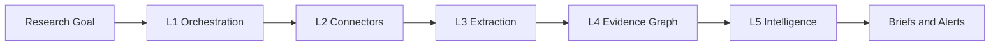

# InsightFlow

**Continuous market intelligence powered by autonomous research workflows.**

InsightFlow treats research as a **long-running workflow**, not a one-shot chat prompt. Users define a research goal once; the platform continuously collects sources, extracts claims, builds an evidence graph, detects changes, and generates intelligence updates.

**Differentiator:** Prompt → Report (most AI tools) vs Research Goal → Workflow → Evidence → Knowledge Graph → Continuous Monitoring → Intelligence Updates.

## Architecture



| Layer | Status | Location |
|-------|--------|----------|
| L1 Orchestration | Partial | `src/executor.js`, `src/worker.js`, `src/queue/` |
| L2 Connectors | M3 | `src/connectors/` |
| L3 Extraction | M4 | `src/extraction/` |
| L4 Evidence Graph | M5 | `prisma/schema.insightflow.sketch.prisma` |
| L5 Intelligence | M7 | `src/intelligence/` |

## L1 engine (implemented)

| Capability | Description |
|------------|-------------|
| DAG execution | Parallel steps, dependency ordering |
| Job queue | DB-backed worker (`execution_jobs`) |
| I/O propagation | Upstream outputs flow to downstream steps |
| Failure handling | Retries, terminal `FAILED`, downstream `BLOCKED` |
| Webhooks | Ingress triggers + completion callbacks |

## Research pipeline

```
Research Goal → Source Discovery → Collection (parallel) → Claim Extraction
  → Evidence Validation → Knowledge Graph → Change Detection → Report
```

- Recipes: [`src/templates/researchRecipes.js`](src/templates/researchRecipes.js)
- Task roadmap: [`src/domain/taskMapping.js`](src/domain/taskMapping.js)
- Vocabulary: [`src/domain/vocabulary.js`](src/domain/vocabulary.js)

## API

| Method | Path | Description |
|--------|------|-------------|
| `GET` | `/health` | Health check |
| `GET` | `/api/research/recipes` | Research DAG recipes |
| `GET` | `/api/research/task-mapping` | Interim vs planned task types |
| `POST` | `/api/workflows` | Create workflow (backing DAG) |
| `GET` | `/api/workflows/:id` | Get workflow |
| `POST` | `/api/workflows/:id/run` | Queue a research run |
| `GET` | `/api/workflows/executions/:id` | Run details + step I/O |
| `POST` | `/api/webhooks/:workflowId` | Webhook trigger |

## Getting started

```bash
cp .env.example .env
# Set DATABASE_URL

npm install
npm run db:migrate

npm start          # Terminal 1 — API
npm run worker     # Terminal 2 — worker
```

## Repo layout

Monorepo until beta. Engine and product evolve together in this repo.

```
src/domain/          Vocabulary, task mapping
src/templates/       Research DAG recipes
src/modules/         API (workflows, research, webhooks)
src/connectors/      L2 (M3)
prisma/schema.prisma L1 migrations (active)
automation-playground/  Legacy inspector — rename at M9
```

Future schema sketch: [`prisma/schema.insightflow.sketch.prisma`](prisma/schema.insightflow.sketch.prisma)

## Scripts

| Script | Purpose |
|--------|---------|
| `npm start` | HTTP API |
| `npm run worker` | Process queued runs |
| `npm run db:migrate` | Apply L1 migrations |
| `npm run test:io` | Engine I/O propagation tests |

## Milestones

Local progress: `INSIGHTFLOW_PROGRESS.local.md` (gitignored).

- **M0** — Foundation alignment
- **M1** — Research workspaces
- **M2+** — Recipes, connectors, graph, briefs
